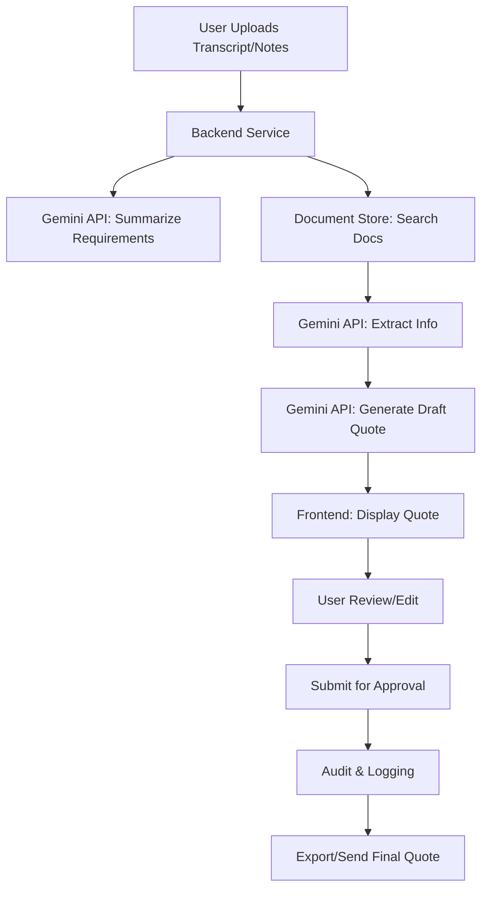
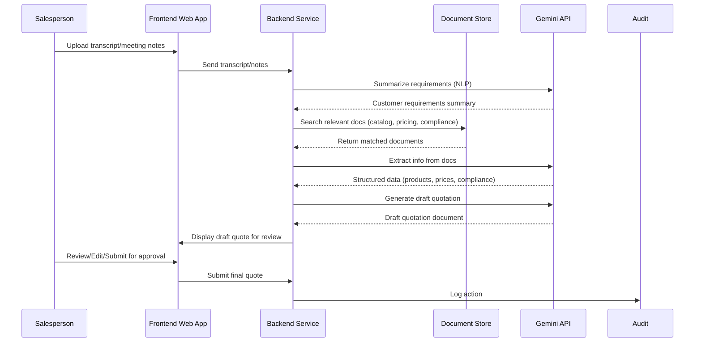
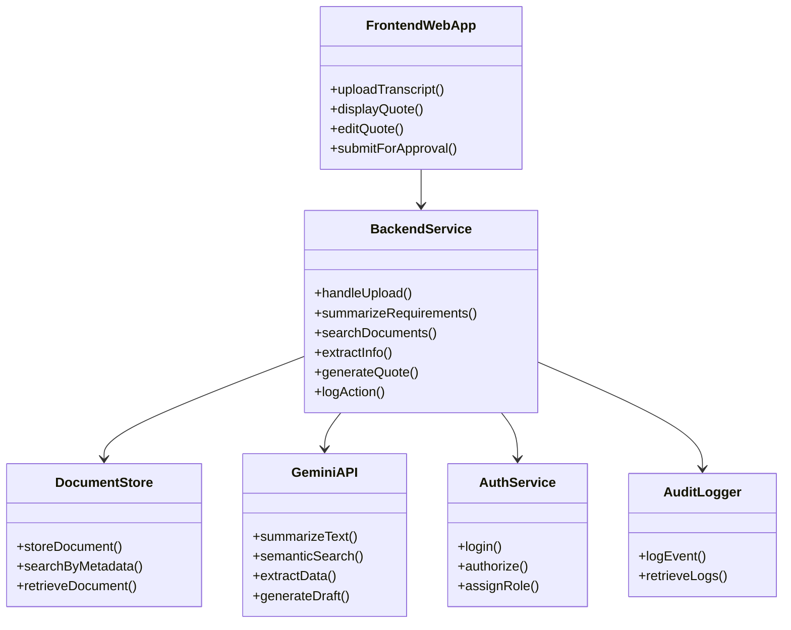

# Sales Quotation AI – MVP System Design

---

## Problem Statement

After a salesperson communicates with a potential customer, they must review product catalogs, pricing, and compliance documentation to build a quote based on the customer’s requirements. This process can take weeks.

## Solution Overview

Build a system that uses meeting transcripts and notes to:

1. Search catalogs, pricing, and compliance documents for relevant information using Gemini API.
2. Analyze and extract necessary details from these documents.
3. Generate a draft quotation document for review and approval.

---

## High-Level Architecture

- **Frontend Web App:** User interface for uploading data, reviewing, and editing quotes.
- **Backend Service:** Orchestrates workflows, communicates with Gemini API, manages business logic.
- **Document Store:** Holds catalogs, pricing, and compliance docs, with metadata indexing.
- **Gemini API Integration:** Powers semantic search, extraction, and generation tasks.
- **Authentication & User Management:** Handles secure access and roles.
- **Audit & Logging:** Tracks all actions for compliance and review.

---

w

## System Flow Diagram

---

## Sequence Diagram

---

## Module/Class Diagram

---

## Component Nuances & Responsibilities

### 1. Frontend Web App

- **Function:** User interface for uploading transcripts/notes, reviewing/editing quotes, and managing approvals.
- **Nuances:**
  - Supports file upload and drag/drop.
  - Integrates with meeting platforms (future).
  - Rich text editor for quote review.
  - Handles authentication tokens.

### 2. Backend Service

- **Function:** Orchestrates the workflow, manages API calls, processes business logic.
- **Nuances:**
  - Stateless REST API (Node.js/Express or Python/FastAPI).
  - Handles request validation and error management.
  - Integrates with cloud/local storage for documents.
  - Coordinates Gemini API calls for summarization, search, extraction, and generation.

### 3. Document Store

- **Function:** Stores catalogs, pricing, and compliance docs (PDF, Word, etc.).
- **Nuances:**
  - Supports metadata indexing for efficient search.
  - Manages versioning and tagging of documents.
  - Can use cloud storage (S3/GCP) or local disk for MVP.

### 4. Gemini API Integration

- **Function:** Provides NLP capabilities for summarization, semantic search, information extraction, and quote generation.
- **Nuances:**
  - Handles batching and rate limits.
  - Parses and validates Gemini responses.
  - Abstracted through a service layer for easy replacement/upgrades.

### 5. Authentication & User Management

- **Function:** Secure login, role-based access (salesperson, manager, admin).
- **Nuances:**
  - JWT/OAuth for session management.
  - Role assignment and permissions enforcement.

### 6. Audit & Logging

- **Function:** Tracks all actions for compliance, review, and debugging.
- **Nuances:**
  - Stores logs securely.
  - Provides search/filter capabilities for audits.

---

## Data Flow Example

1. **Input:** Transcript PDF/meeting notes (text)
2. **Gemini Summarization:** Extract customer requirements
3. **Semantic Search:** Find relevant docs
4. **Extraction:** Pull product specs, pricing, compliance
5. **Quote Generation:** Draft quote
6. **Review:** Salesperson edits, adds comments
7. **Approval:** Manager reviews, approves/rejects
8. **Output:** Downloadable/exportable quote (PDF/Word)

---

## Security & Compliance

- Data encrypted at rest and in transit
- Role-based access controls
- Audit trail for all actions
- Compliance with relevant data privacy laws (GDPR, etc.)

---

## MVP Roadmap

1. Document ingestion, Gemini-powered requirement extraction, semantic search, and draft quote generation.
2. User review/edit, approval workflow, and export.
3. Integration with meeting platforms, CRM, analytics, and feedback loop.

---

## Next Steps

- Review and finalize system design
- Define MVP user stories and acceptance criteria
- Set up Gemini API access and credentials
- Begin backend scaffolding and document ingestion pipeline
